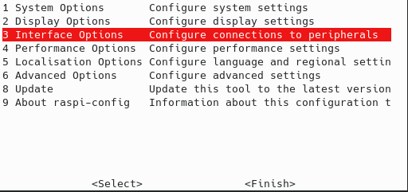
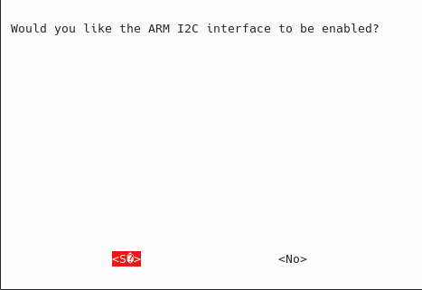
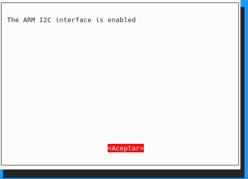
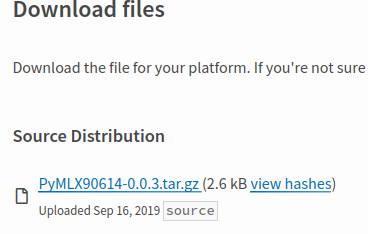
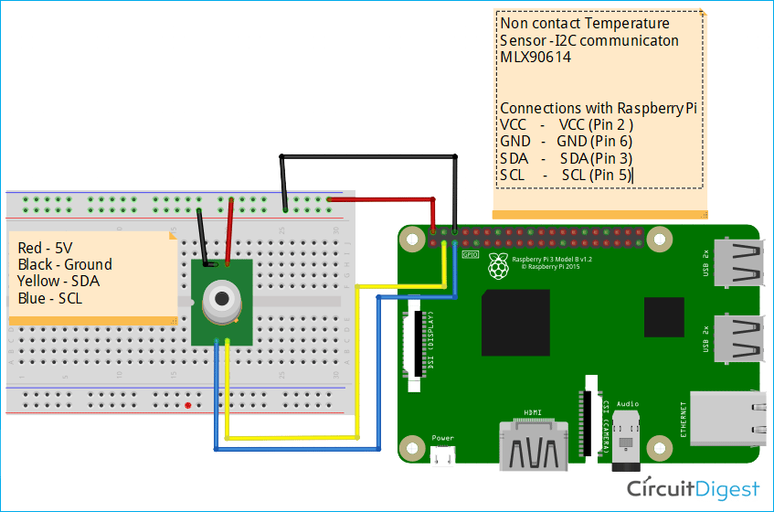
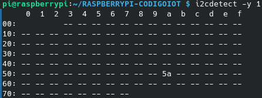

# LECTOR DE TEMPERATURA INFRARROJO MLX90614 en Raspberry Pi 3B+
# Descripción
Programa en python para el manejo del sensor de temperatura infrarrojo MLX90614 en la raspberry pi 3B+, el cúal toma lectura de la temperatura en la habitación y de algún objeto que se acerque al sensor, estos valores son enviados independientemente a dos temas distintos a través de MQTT para posteriormente ser monitorizados en node-red.
# Instrucciones
## Habilitar la interfaz i2c en los ajustes de la raspberry pi
- Abrimos una terminal e ingresamos el siguiente comando: `sudo raspi-config`, posteriormente aparecerá la siguiente ventana: 
- Una vez ahi, seleccionaremos las opciones de interfaz, y seleccionaremos la interfaz i2c.
- Nos pedirá una confirmación y le diremos que sí.
- Ahora tednremos habilitada la interfaz i2c de nuestra raspberry pi.
## Librería PyMLX90614.
Librería en python para el manejo del sensor de temperatura infrarrojo MLX90614, que funciona con ayuda del modulo [smbus2](https://pypi.org/project/smbus2/). Compatible con Python 2 y Python 3.
## Descargar e instalar la librería PyMLX90614.
Tenemos que dirigirnos al siguiente enlace: [PyMLX90514](https://pypi.org/project/PyMLX90614/#files), donde descargaremos el siguiente archivo: 
para no usar demasiados recursos en la raspberry, utilizaremos **wget** para descargar el archivo, ingresaremos el siguiente comando: 

`wget https://files.pythonhosted.org/packages/67/8a/443af31ff99cca1e30304dba28a60d3f07d247c8d410822411054e170c9c/PyMLX90614-0.0.3.tar.gz`

nos descargará el archivo mencionado anteriormente en el directorio donde nos encontremos en la terminal, el cual descomprimiremos con el siguiente comando:

`tar -xf PyMLX90614-0.0.3.tar.gz`

Después, necesitaremos algunos programas extra para la instalación de la librería, por lo tanto, ingresa el siguiente comando en la terminal.

Recuerda que debes tener actualizado tus repositorios, así que corre el siguiente comando para actualizarlos
`sudo apt-get update`
- Python setup tools.
  
  `sudo apt-get install python-setuptools`
- i2c-tools

  `sudo apt-get install i2c-tools`

Una vez instalado los paquetes mencionados, dirigete al directorio resultante de la descompresión del archivo y corre el siguiente comando:

`sudo python setup.py install`

Una vez completados estos pasos solo queda armar el circuito y probar el programa.
## Diagrama del circuito sugerido.
Las conexiones sugeridas y el diagrama esquemático utilizado es el siguiente: 

## Comprobar que el sensor es detectado por la raspberry.
si las conexiones y el soporte i2c fue habilitado correctamente, podemos comprobar si la dirección lógica del sensor es detectada por el i2c bus usando el siguiente comando:

`i2cdetect -y 1`

obteniendo la siguiente salida si el sensor está siendo detectado: 

**0x5A** representa la dirección lógica del sensor, esto es mencionado en la hoja de datos del fabricante:

## Instalación del módulo MQTT(Paho)
Puedes instalar el módulo MQTT Paho usando PIP con el siguiente comando:
`pip install paho-mqtt`

Si no cuentas con PIP, puedes instalarlo desde la terminal con el siguiente comando:
- pip para Python 2.7
     
     `sudo apt-get install python-pip` 
- pip para Python 3.x
  
     `sudo apt-get install python3-pip`

## Versiones de Python.
Durante toda esta guia hemos usado el comando `python` seguido de muchas opciones, es importante saber que la raspberry maneja el comando `python` como Python 2.7, el cúal esta descontinuado pero muchos módulos aún funcionan con el, por lo cual si quieres que el programa corra sobre Python 3 tendrás que usar el comando `python3` y `pip3` respectivamente en vez de `python` y `pip`.

